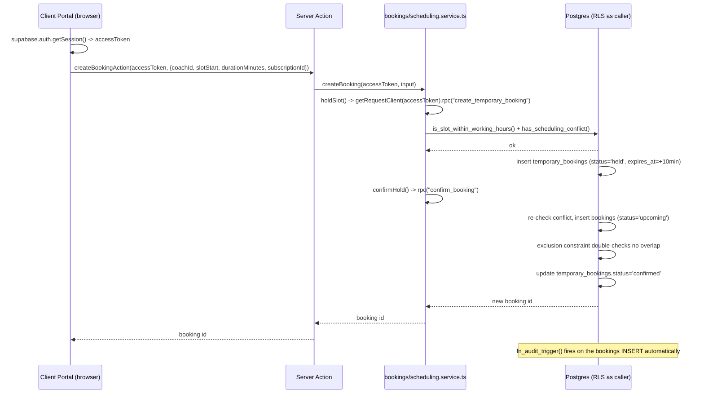
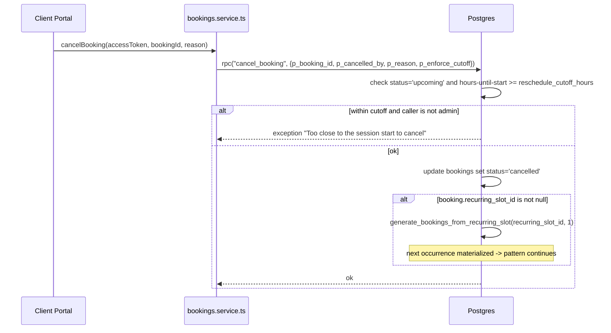
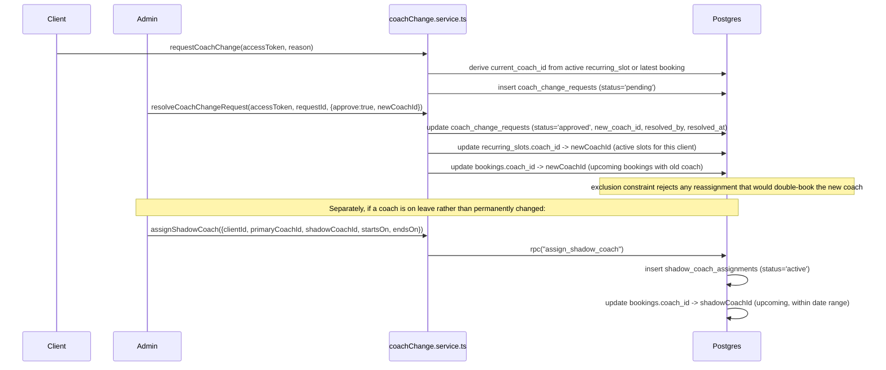

# Booking Flow Sequence Diagrams

## New booking (hold → confirm)



## Cancellation with slot recovery



## Reschedule (same booking row, in place)

```mermaid
sequenceDiagram
    participant UI as Client or Admin Portal
    participant SVC as bookings.service.ts
    participant DB as Postgres

    UI->>SVC: rescheduleBooking(accessToken, bookingId, newStart, newDuration?)
    SVC->>DB: rpc("reschedule_booking", {...})
    DB->>DB: check status='upcoming' + cutoff (unless admin)
    DB->>DB: is_slot_within_working_hours(new time) + has_scheduling_conflict(new time)
    alt conflict or outside working hours
        DB-->>SVC: exception
    else ok
        DB->>DB: update bookings set scheduled_start=new, duration_minutes=new
        Note over DB: same id -> workout_notes/attendance FKs stay valid; no recurring regeneration
    end
```

## Coach-change request with shadow-coach fallback


