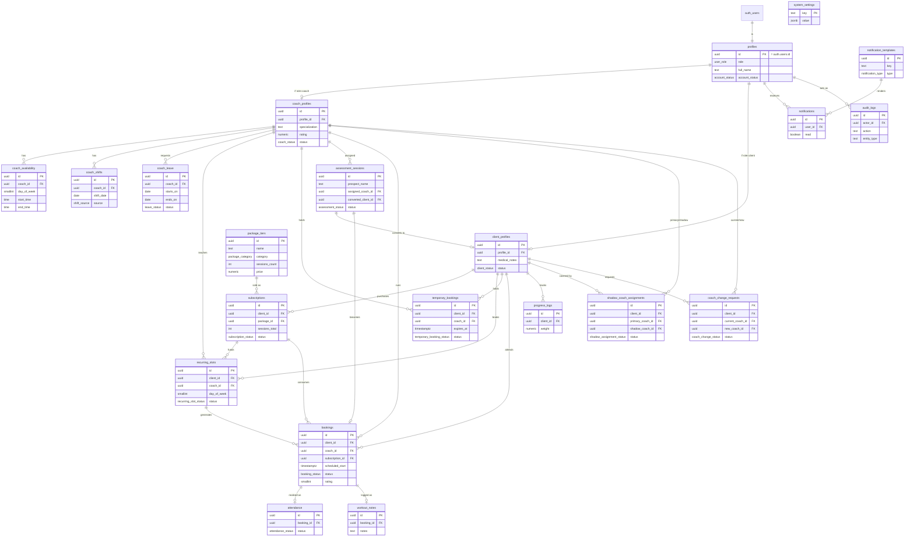

# LEANR — Entity Relationship Diagram

Covers every table created in `supabase/migrations/0001`–`0009`. Views (0010) are omitted since they don't hold data of their own — see [api.md](./api.md) for what they expose.

